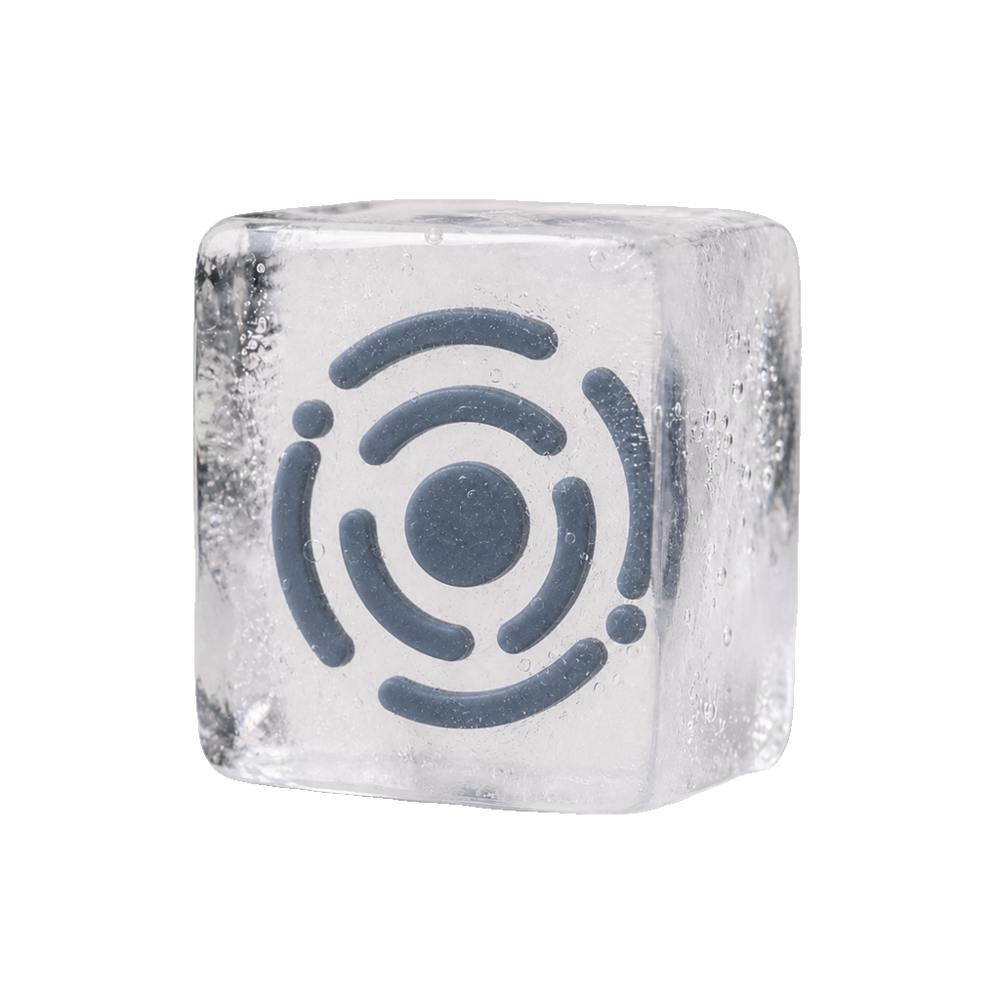

  

<h1 align="center">Chaos</h1>

Chaos 管的是投递和对象存储：邮件模板、邮件发送、S3 兼容的对象存储操作，都在这一处收敛。接口由 Aegis 保护，各家供应商的细节被挡在服务层后面，调用方看到的是统一的抽象，不用关心底下是 SMTP 还是 R2。

Chaos centralizes delivery and object storage — email templates, sending, and S3-compatible file operations. APIs are protected by Aegis, and provider-specific details stay hidden behind the service layer, so callers get one abstraction whether it's SMTP or R2 underneath.

## 邮件事件链路

`POST /api/mail` 不直接连接 SMTP。API 严格校验请求后生成私有 CloudEvent，使用从 Chaos 服务 seed 按用途派生的密钥对事件身份与数据进行 HMAC-SHA256 签名，并投放到固定的 Knative RabbitMQ Broker HTTP 入口。Knative `Trigger` 将匹配的事件投递到 Chaos 的 `/internal/events/mail-delivery`；消息只有在 type、source、签名、事件 ID、收件地址、模板 ID、变量大小和过期时间全部验证通过后才进入模板渲染与 SMTP 投递。

API 入队前会确认模板存在且启用，并使用请求变量严格渲染主题和正文；
模板语法错误、缺少变量或渲染后的主题不安全时不会创建投递任务。

邮件 API 只接受 Aegis Service Access Token，并要求调用方提供
`Idempotency-Key`。完整请求、响应、错误与重试契约见
[`docs/mail-api.md`](docs/mail-api.md)。

路由、重试和 dead-letter 策略由 Kubernetes 中的 `Broker`/`Trigger` 声明管理，不再由服务进程创建或维护消息队列 consumer。
